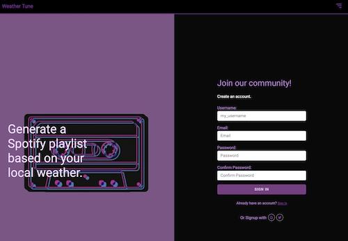

# Weather tune

---

## An application that generates a spotify playlist for you, based on the weather in your current location.

## Technologies Used

- Web Framework - Django
- Language - Python3
- Styling - Bootstrap

## API

- Spotify API & OpenWeatherMap API with OAuth 2.0 Authentication.




## Installation

To Install project packages

Create and activate a virtual environment. Use Python3 as the interpreter. Suggest locating the venv/ directory outside of the code directory.

Clone the project

```bash
  git clone https://github.com/saida93522/weather-tune.git
```

Go to the project directory

```bash
  cd weather-tune
```

Install dependencies

```bash
  pip install -r requirements.txt
  pip install spotipy --upgrade

```

Use SQLite database locally.

```bash
  python manage.py makemigrations
  python manage.py migrate
```

Start the server

```bash
  run python manage.py runserver
```
